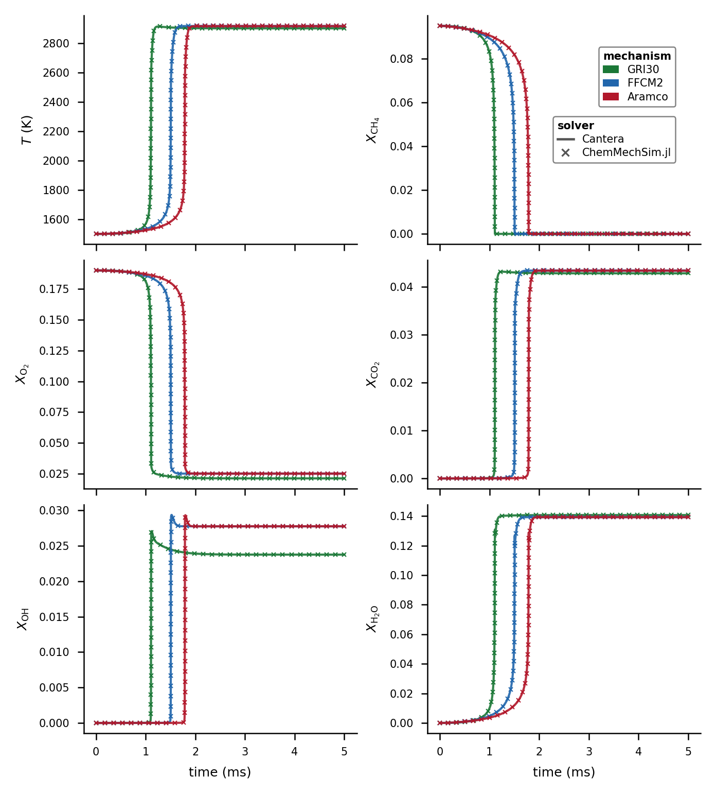
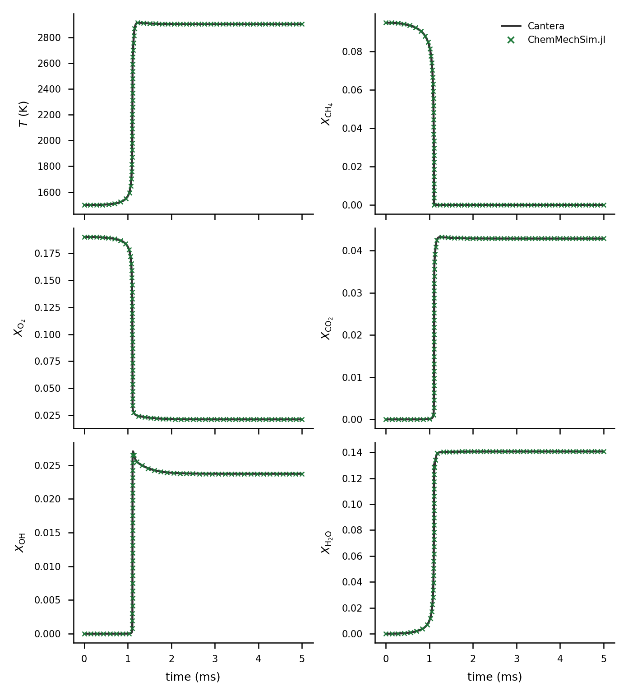

# Validation

ChemMechSim is validated against [Cantera](https://cantera.org/) on real mechanisms
(GRI30, H2-O2, FFCM-2, Aramco 3.0). Cantera is **not** a CI dependency: the Python
scripts in `examples/validation/` generate reference CSVs that are compared offline
with ChemMechSim output. Both sides run at the *same* tolerances (`rtol=1e-8`,
`atol=1e-12`) rather than Cantera's stricter defaults, so the comparison isolates the
model/implementation, not the integrator tolerance.

## Workflow A — per-mechanism ignition delay

Each `<mech>_ref.py` generates a Cantera const-V (and for H2-O2, const-P) ignition
CSV; the matching `<mech>_ignition.jl` runs ChemMechSim on the same condition,
reports the ignition-delay relative difference, and saves a comparison plot.

```bash
python3 examples/validation/gri30_ref.py
julia --project=. examples/validation/gri30_ignition.jl
```

**Metric:** `t_ignition` = time of maximum `|dT/dt|` (robust against noise).

| Mechanism | scripts | Δt_ign tolerance |
|---|---|---|
| H2-O2 (const-V / const-P) | `h2o2_ignition.{py,jl}` | 5% / 8% |
| GRI-30 | `gri30_{ref,ignition}.*` | 10% |
| FFCM-2 | `ffcm2_{ref,ignition}.*` | 2% |
| Aramco 3.0 | `aramco_{ref,ignition}.*` | 2% |

## Workflow B — combined-species trajectories

A three-step pipeline over GRI30 / FFCM2 / Aramco producing the figures and error
table embedded below:

```bash
python3 examples/validation/gen_ref_species.py     # 1. Cantera T + 5 species (CH4, O2, CO2, OH, H2O)
julia --project=. examples/validation/export_species.jl   # 2. ChemMechSim, same grid
python3 examples/validation/plot_validation.py     # 3. figures + validation_errors.txt
```

`export_species.jl` uses `jac=true` + `FBDF(linsolve=UMFPACKFactorization())` uniformly
across mechanisms — required for Aramco (581 sp) where the default dense Jacobian
OOMs.

## Combined-species results



GRI-Mech 3.0, same condition as workflow A:


Error table from workflow B (`validation_errors.txt`; condition: T0 = 1500 K,
P0 = 1 atm, phi = 1.0 CH4-air, constant-volume adiabatic, t in [0, 5] ms.
Δt_ign in %, max ΔX = max absolute mole-fraction difference over the trajectory
for each of CH4, O2, CO2, OH, H2O):

| Mechanism | Δt_ign | max ΔX (CH4 / O2 / CO2 / OH / H2O) |
|---|---|---|
| GRI-Mech 3.0 | 0.065% | 4.3e-3 / 2.0e-2 / 3.4e-3 / 8.6e-3 / 1.3e-2 |
| FFCM 2.0 | 0.168% | 1.6e-2 / 3.9e-2 / 1.7e-2 / 1.7e-2 / 3.1e-2 |
| Aramco 3.0 | 0.333% | 2.2e-2 / 7.2e-2 / 2.5e-2 / 2.4e-2 / 5.2e-2 |

Figures and the error table are produced by the repository scripts above; the
committed copies under `docs/src/assets/` are their direct output (workflow-B data
run of 2026-09-17, figures re-rendered on the current tree — the only `src/`
changes since are docstring-only plus two commits off these code paths; the GRI30
leg is re-verified on current main: t_ign = 1.108 ms, 0.01% vs Cantera).

## PLOG rates

PLOG `kf` is validated in the **test suite** (`test/test_plog.jl`) against
`test/data/plog_ref_rates.csv`, regenerable via `test/tools/plog_ref.py` with
Cantera installed.

Details, per-script notes and artifact inventory: `examples/validation/README.md`.
